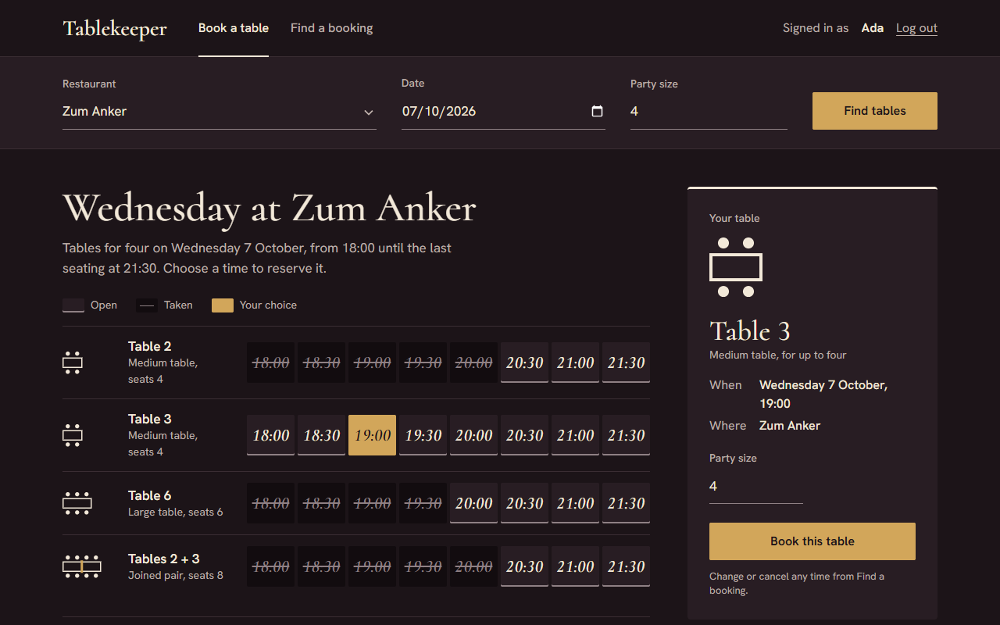

# Tablekeeper, built by a six-seat dark factory

**Six AI seats, a restaurant booking service in four stages, and one message from a human per stage.** An architect, a critic, a designer, a builder, a verifier and a release clerk planned, built, reviewed and shipped Tablekeeper in one Band Desktop room. Apart from the operator's two commits (set-up before the run, room log and write-up after it), every commit names the seat that made it.

Entry for the WeAreDevelopers x BAND "Dark Factory" hackathon, track **Tablekeeper**. Team: LippInc.



## Result

| Stage | What it added | The organizers' harness (isolated) | Task to final report |
|---|---|---|---|
| 1 | JSON API: availability, idempotent bookings, atomic moves, export and import | claims stage 1 | 3 h 51 min |
| 2 | Browser UI in the "Dinner service" look, combined tables, recovery from lost responses | claims stage 2 | 5 h 46 min |
| 3 | Dated booking policies and accepted terms, reservation history, recurring reservations, availability explanations | claims stage 3 | 5 h 17 min |
| 4 | Seating repairs after a table closure (preview, then apply), amending recurring reservations, the restaurant revision | claims stage 4; passes every shipped check of suites 1 to 4 | 8 h 46 min |

Human input: one task message per stage, nothing else (the room log, `room.json`, shows every message). How the factory works, what it cost and what failed along the way: [FACTORY.md](FACTORY.md).

This repository is the factory's second full run: all four stages, 3,260 room messages, $513 of API-price-equivalent model use. The first run reached stage 3 and stopped in stage 4 when its Band room stopped taking messages at 10,000; what that taught the factory is in FACTORY.md.

## How to read this repository

| Path | What it is | Who wrote it |
|---|---|---|
| `FACTORY.md` | The factory: seats, the loop, how it stays hands-off, how it catches bad work, stand-up steps, failures, measured time and cost | the team |
| `mandates/` | One generic mandate per seat, named after the seat as the room shows it; each starts with its harness and model | the team |
| `factory/` | The stand-up script (Windows PowerShell, with a bash twin for macOS and Linux) and its known-bad tests, the workspace templates the seats get, and a read-only watcher for the room | the team |
| `room.json` | The full room (3,260 messages), downloaded unchanged from the Band console ("Download full session") | Band |
| `stage-1/` ... `stage-4/` | One complete service per stage (`Dockerfile`, `RUN.md`, source), each carried forward from the previous stage and extended | builder |
| `acceptance/stage-N/` | The verifier's own checks, written from each stage's specification and calibrated against a known-bad | verifier |
| `design/` | The design system the builder follows and the designer reviews against | designer |
| `EVIDENCE.md` | Verdicts, gates and the reverse check for each item and stage | release clerk |

Apart from the operator's two commits (the set-up before the run: README, FACTORY draft, mandates, stand-up script; and after the run: room.json, this README, the final FACTORY.md, the watcher update and small fixes to the stand-up scripts), every commit names the seat that made it (author name = seat) and starts with the unit and item it belongs to, so the git log and the room can be read side by side.

## Run a stage

Each stage folder is a service on its own: follow its `RUN.md`. To grade a folder the way judges do, from the organizers' package:

```
python -m harness run --track tablekeeper --repo <this repository> --stage N --mode isolated --out <new folder>
```
